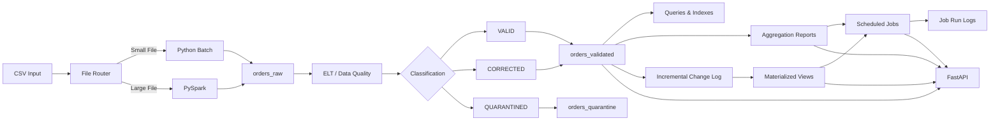

# BigData Hybrid Pipeline

> A production-oriented hybrid Big Data pipeline for ingesting, validating, transforming, querying, aggregating, and serving large-scale mixed-quality order data through MongoDB, PySpark, Python batch processing, scheduled jobs, and FastAPI.

## Project Overview

**BigData Hybrid Pipeline** implements an end-to-end data platform for large and mixed-quality order datasets.

The system combines:

- **Python batch processing** for smaller inputs
- **PySpark** for large-scale inputs
- **MongoDB** as the raw, validated, quarantine, and analytical storage layer
- **Incremental processing** for efficient updates
- **MongoDB indexes and query execution analysis**
- **Aggregation reports**
- **Materialized views**
- **Scheduled jobs**
- **FastAPI** as a unified REST API
- **Reproducible execution and verification reports**

The design follows a **raw-first architecture**: source records are preserved before validation and transformation, allowing traceability, auditing, and reprocessing.

---

## Architecture



### Core processing flow

```text
Input CSV
   │
   ▼
File Router
   │
   ├── Python Batch ──┐
   │                  │
   └── PySpark ───────┤
                      ▼
                 orders_raw
                      │
                      ▼
              ELT / Data Quality
                      │
          ┌───────────┼───────────┐
          ▼           ▼           ▼
        VALID      CORRECTED   QUARANTINED
          │           │           │
          └──────┬────┘           │
                 ▼                ▼
        orders_validated   orders_quarantine
                 │
       ┌─────────┼─────────┬──────────────┐
       ▼         ▼         ▼              ▼
    Queries  Aggregations  MVs      Scheduled Jobs
       │         │         │              │
       └─────────┴─────────┴──────┬───────┘
                                  ▼
                               FastAPI
```

---

# 1. Processing Engines

## Automatic Engine Selection

The router evaluates the input file size and selects the processing engine automatically.

The configured threshold is:

```text
200 MB
```

Decision rule:

```text
File <= 200 MB  → Python Batch
File > 200 MB   → PySpark
```

Example:

```powershell
python -m src.main --input "path\to\orders.csv"
```

The router reports:

- Input path
- File size
- Selected engine
- Routing reason

---

## Python Batch Engine

The Python path is intended for smaller datasets and uses batched writes to MongoDB.

Characteristics:

- Explicit CSV handling
- Controlled batch size
- MongoDB bulk writes
- Raw-first ingestion
- Processing metadata
- Throughput measurement

---

## PySpark Engine

Large inputs are processed through **Apache Spark / PySpark**.

The large-scale execution path uses:

- PySpark **4.2.0**
- Spark local execution: `local[*]`
- Explicit string-oriented CSV schema handling
- Partition-aware processing
- MongoDB Spark Connector

Large CSV input does not rely on automatic schema inference. This provides predictable handling of mixed-quality source values.

---

# 2. Raw-First Data Architecture

All ingestion paths write source records to:

```text
orders_raw
```

before quality processing.

Raw records preserve the original source payload together with ingestion metadata such as:

```text
run_id
source_file
source_path
source_row_number
ingested_at
engine_used
raw_record
```

This creates a traceable lineage chain:

```text
Source File
    ↓
Raw Record
    ↓
Validated / Corrected / Quarantined Record
```

The raw layer remains available for auditing and reprocessing.

---

# 3. Data Quality Processing

Every record is classified into one of three quality states.

| State | Meaning |
|---|---|
| `valid` | The record satisfies the defined quality rules without modification |
| `corrected` | Recoverable quality problems were repaired safely |
| `quarantined` | The record contains an unrecoverable or conflicting problem |

### Correction capabilities

The pipeline supports correction categories including:

- Arabic digit normalization
- Decimal separator normalization
- Phone normalization
- Date normalization
- Email normalization
- Whitespace trimming
- Order-total recalculation
- Currency normalization
- Thousands-separator normalization
- Known price-word conversion
- Item-total derivation
- Item-price derivation
- Negative-quantity correction
- Status synonym normalization

Each applied correction is recorded in the processed document.

---

# 4. Quarantine and Error Handling

Unrecoverable records are written to:

```text
orders_quarantine
```

Instead of silently dropping bad data, the pipeline preserves the failed record and its processing context.

Quarantine records can contain:

- Original raw record
- Cleaned preview
- Corrections
- Error codes
- Error details
- Source run ID
- Source file/path
- Source row number
- Raw ingestion timestamp
- Processing run ID
- Processing timestamps

Representative error codes include:

```text
MISSING_ORDER_ID
MISSING_CUSTOMER_ID
EMAIL_INVALID_UNRECOVERABLE
PHONE_INVALID_UNRECOVERABLE
CORRUPTED_ITEMS_JSON
EMPTY_ITEMS
TOTAL_UNKNOWN_UNRECOVERABLE
INVALID_IMPOSSIBLE_DATE
STATUS_UNKNOWN
CURRENCY_UNKNOWN
DUPLICATE_ORDER_ID
MULTIPLE_CONFLICTING_ERRORS
```

---

# 5. Duplicate Detection and Idempotency

The validated collection uses:

```text
order_id
```

as the business key.

MongoDB upserts ensure that reprocessing an existing business entity does not create a second document.

The pipeline also uses stable record fingerprints.

Processing behavior:

```text
Same business key + same fingerprint
        → unchanged

Same business key + changed payload
        → update existing record

New business key
        → insert new record
```

This supports idempotent execution and safe reprocessing.

---

# 6. Data Lineage

Validated records retain lineage information connecting them to the source ingestion run.

Typical lineage fields:

```text
raw_run_id
source_file
source_path
source_row_number
raw_ingested_at
engine_used
```

Processing metadata includes:

```text
last_processing_run_id
first_processed_at
last_updated_at
```

This makes individual records traceable back to their original source.

---

# 7. MongoDB Storage Model

### Primary collections

| Collection | Purpose |
|---|---|
| `orders_raw` | Original source records plus ingestion metadata |
| `orders_validated` | Valid and corrected business records |
| `orders_quarantine` | Unrecoverable or conflicting records |

### Final-stage analytical collections

| Collection | Purpose |
|---|---|
| `daily_sales_summary` | Materialized daily sales summary |
| `top_products_summary` | Materialized product-level sales summary |
| `scheduled_job_runs` | Execution log for scheduled jobs |

Incremental state and change tracking are stored separately to support efficient materialized-view refreshes.

---

# 8. Indexes and Query Optimization

The final project includes practical indexes on `orders_validated`.

### Key indexes

```text
uq_orders_validated_order_id
ix_validated_quality_status
ix_validated_city
ix_validated_status
ix_validated_city_status
```

The final index:

```text
(city, status)
```

is a **compound index**.

### Query set

Five independently runnable practical queries are implemented:

```text
by_city
by_status
by_city_status
by_customer
by_date_range
```

Each query can be accessed through the API.

---

## Recorded `executionStats` Evidence

The following measurements were collected on the project dataset.

| Query | Before: docs examined | After: docs examined | Before: time | After: time |
|---|---:|---:|---:|---:|
| City = تعز | 27,496,497 | 2,750,556 | ~25.5 s | ~19.9 s |
| Status = مؤكد | 27,496,497 | 4,582,124 | ~24.1 s | ~19.4 s |
| City + Status | 27,496,497 | 458,988 | ~25.8 s | ~20.9 s |

The compound query uses the compound index:

```text
ix_validated_city_status
```

with an `IXSCAN` followed by document fetch.

The primary optimization effect is the large reduction in documents examined:

```text
Full collection scan
        ↓
Index-assisted scan
        ↓
Only matching documents fetched
```

Wall-clock execution time remains influenced by the number of documents returned, storage I/O, and the cost of fetching large result sets.

---

# 9. Aggregation Reports

The project contains five independently runnable aggregation reports.

### Implemented reports

```text
sales_by_city
top_customers
sales_by_status
sales_by_payment_method
sales_by_delivery_type
```

Each report:

1. Runs directly against actual MongoDB data.
2. Uses a MongoDB aggregation pipeline.
3. Produces a named report.
4. Can be executed independently.
5. Returns structured results suitable for API consumption or report generation.

---

# 10. Incremental Processing

The project implements incremental updates rather than rebuilding analytical state from scratch after every change.

The incremental mechanism tracks:

- Processed operation identifiers
- Record changes
- Watermarks
- Inserted documents
- Updated documents
- Unchanged documents

A repeated operation is detected and does not get applied twice.

This provides:

```text
Idempotent Incremental Processing
```

Example behavior:

```text
First application:
inserted = 1
updated  = 1

Same operation replayed:
inserted = 0
updated  = 0
unchanged = 2
```

---

# 11. Materialized Views

Two materialized views are implemented.

### `daily_sales_summary`

Provides daily:

- Order count
- Sales totals

### `top_products_summary`

Provides product-level:

- Quantity
- Sales totals

The materialized views are maintained incrementally using a watermark/change-log approach.

### Initial build

The recorded initial build generated:

```text
daily_sales_summary → 121 day groups
top_products_summary → 6 products
```

### Incremental refresh

Refresh command:

```powershell
python -m src.materialized_views --refresh
```

A refresh processes only records newer than the stored watermark and applies inserts/updates to the materialized state.

This avoids rebuilding the full materialized views on every refresh.

---

# 12. Scheduled Jobs

Two scheduled jobs are implemented.

| Job | Schedule | Responsibility |
|---|---|---|
| `refresh_materialized_views` | 02:00 | Incrementally refresh analytical materialized views |
| `generate_daily_sales_report` | 02:30 | Generate the daily sales report |

Job execution is persisted in:

```text
scheduled_job_runs
```

Each execution records:

```text
start time
end time
duration
status
result
error details
```

Jobs can also be triggered manually through the API.

---

# 13. FastAPI

FastAPI provides the unified application interface.

Start the API with:

```powershell
python -m uvicorn src.api:app --host 127.0.0.1 --port 8000
```

Interactive API documentation is available at:

```text
http://127.0.0.1:8000/docs
```

OpenAPI specification:

```text
http://127.0.0.1:8000/openapi.json
```

---

## API Endpoints

| Method | Endpoint | Purpose |
|---|---|---|
| `GET` | `/health` | Service health check |
| `POST` | `/ingest` | Route and ingest source data through the existing pipeline |
| `POST` | `/indexes` | Create / verify project indexes |
| `GET` | `/queries` | List available queries |
| `GET` | `/queries/{name}` | Execute a named query |
| `GET` | `/aggregations` | List available aggregation reports |
| `GET` | `/aggregations/{name}` | Execute a named aggregation |
| `POST` | `/refresh-mv` | Refresh materialized views incrementally |
| `GET` | `/jobs` | List scheduled jobs |
| `POST` | `/jobs/{name}/run` | Run a scheduled job manually |

### Important ingestion design

`POST /ingest` reuses the same routing and processing path used by the command-line pipeline.

The API does **not** introduce a separate ingestion implementation.

---

# 14. Example API Usage

### Health check

```powershell
Invoke-RestMethod "http://127.0.0.1:8000/health"
```

### List queries

```powershell
Invoke-RestMethod "http://127.0.0.1:8000/queries"
```

### Execute a city query

```powershell
Invoke-RestMethod "http://127.0.0.1:8000/queries/by_city?city=تعز&limit=5"
```

### Execute a compound query

```powershell
Invoke-RestMethod "http://127.0.0.1:8000/queries/by_city_status?city=تعز&status=مؤكد&limit=5"
```

### Run an aggregation

```powershell
Invoke-RestMethod "http://127.0.0.1:8000/aggregations/sales_by_city"
```

### Refresh materialized views

```powershell
Invoke-RestMethod -Method POST "http://127.0.0.1:8000/refresh-mv"
```

### Run a scheduled job

```powershell
Invoke-RestMethod -Method POST "http://127.0.0.1:8000/jobs/refresh_materialized_views/run"
```

---

# 15. Large-Scale Recorded Execution

The recorded large dataset contains:

```text
30,000,000 records
≈ 12.65 GB input
```

Recorded classification:

| Classification | Records |
|---|---:|
| Valid | 20,994,411 |
| Corrected | 6,501,781 |
| Quarantined | 2,503,808 |
| **Total** | **30,000,000** |

Consistency equation:

```text
20,994,411
+ 6,501,781
+ 2,503,808
= 30,000,000
```

Recorded large-file Spark ingestion throughput:

```text
≈ 125,318 records/second
```

Recorded Spark partition counts:

```text
Input partitions  = 99
Output partitions = 99
```

These are recorded execution results, not hardcoded runtime assumptions.

---

# 16. Performance and Verification

Execution reports capture metrics such as:

- Total execution time
- Records processed
- Throughput
- Input partitions
- Output partitions
- MongoDB write time
- Insert counts
- Update counts
- Unchanged counts
- Duplicate statistics
- Quality classification statistics

This provides measurable evidence rather than relying only on successful process completion.

---

# 17. Project Structure

```text
BigData_Hybrid_Pipeline/
│
├── config/
│   └── settings.py
│
├── data/
│   ├── input/
│   └── samples/
│
├── docs/
│
├── reports/
│   ├── classification_dry_run.json
│   ├── elt_write_report.json
│   ├── elt_write_report_final_idempotency.json
│   ├── elt_write_report_first_run.json
│   ├── elt_write_report_large_30m_final.json
│   ├── final_compliance_audit.json
│   ├── final_compliance_audit.md
│   ├── final_verification.json
│   ├── results.json
│   ├── results.md
│   ├── scheduled_daily_sales_report.json
│   ├── spark_large_run.json
│   ├── spark_large_run_final.json
│   ├── spark_loader_test.json
│   └── upsert_update_proof.json
│
├── src/
│   ├── main.py
│   ├── elt_pipeline.py
│   ├── aggregation_reports.py
│   ├── incremental_loader.py
│   ├── materialized_views.py
│   ├── scheduled_jobs.py
│   └── api.py
│
├── tests/
│
├── .gitignore
├── example.env
├── requirements.txt
└── README.md
```

---

# 18. Installation

## Prerequisites

Recommended environment:

```text
Python 3.12+
Java JDK
MongoDB
Apache Spark / PySpark 4.2.0
```

Create a virtual environment:

```powershell
python -m venv .venv
```

Activate it:

```powershell
.\.venv\Scripts\Activate.ps1
```

Install dependencies:

```powershell
pip install -r requirements.txt
```

Verify Python:

```powershell
python --version
```

Verify Java:

```powershell
java -version
```

Verify MongoDB connectivity through the project's MongoDB setup before running ingestion.

---

# 19. Configuration

Configuration is centralized in:

```text
config/settings.py
```

Environment variables include:

```env
MONGO_URI=mongodb://127.0.0.1:27017
MONGO_DATABASE=bigdata_midterm
SMALL_FILE_THRESHOLD_MB=200
BATCH_SIZE=5000
SPARK_MASTER=local[*]
```

Do not commit credentials, private endpoints, or other sensitive configuration values.

Use:

```text
example.env
```

as the safe configuration template.

---

# 20. Running the Pipeline

### Automatic routing and ingestion

```powershell
python -m src.main --input "path\to\orders.csv"
```

### Raw ingestion only

```powershell
python -m src.main --input "path\to\orders.csv" --raw-only
```

### Route inspection without ingestion

```powershell
python -m src.main --input "path\to\orders.csv" --dry-route
```

### Process a specific raw run

```powershell
python -m src.elt_pipeline --raw-run-id "<RAW_RUN_ID>"
```

### Production large-data ELT path

```powershell
python -m src.elt_pipeline --raw-run-id "<RAW_RUN_ID>" --skip-dry-run-contract
```

---

# 21. Reproducibility

The project is designed so that the workflow can be reproduced from the repository documentation.

A clean execution follows:

```text
Install dependencies
      ↓
Configure environment
      ↓
Verify MongoDB / Java / Python
      ↓
Run ingestion
      ↓
Run ELT
      ↓
Create indexes
      ↓
Run aggregation reports
      ↓
Build / refresh materialized views
      ↓
Run scheduled jobs
      ↓
Start FastAPI
      ↓
Verify API endpoints
```

Results and verification artifacts are stored under:

```text
reports/
```

---

# 22. Design Principles

The implementation follows these principles:

1. **Hybrid processing** — choose the right engine for the input scale.
2. **Raw-first ingestion** — preserve source data before transformation.
3. **Explicit data-quality classification** — valid, corrected, or quarantined.
4. **Safe correction** — repair records only when correction is defensible.
5. **Quarantine instead of silent deletion** — preserve problematic data for review.
6. **Business-key upserts** — use `order_id` to prevent duplicate business entities.
7. **Idempotency** — repeated processing should not duplicate state.
8. **Data lineage** — maintain source-to-target traceability.
9. **Incremental analytics** — update materialized state using changes and watermarks.
10. **Measured performance** — record throughput, timing, partitions, and write metrics.
11. **API-first access** — expose core capabilities through a unified FastAPI service.
12. **Reproducibility** — document commands, configuration, and verification artifacts.

---

# 23. Technology Stack

| Layer | Technology |
|---|---|
| Language | Python |
| Small-data processing | Python Batch |
| Large-data processing | PySpark / Apache Spark |
| Database | MongoDB |
| MongoDB client | PyMongo |
| Spark connectivity | MongoDB Spark Connector |
| API | FastAPI |
| API Server | Uvicorn |
| Configuration | Environment Variables + `config/settings.py` |
| CLI / Operations | PowerShell |
| Reporting | JSON / Markdown |

---

# 24. Final Project Deliverables

The final implementation covers the project requirements through:

```text
✓ Practical MongoDB queries
✓ Query indexes
✓ Compound index
✓ executionStats before/after analysis
✓ Five aggregation reports
✓ Two materialized views
✓ Incremental materialized-view refresh
✓ Two scheduled jobs
✓ Persistent job execution logs
✓ Unified FastAPI API
✓ Swagger / OpenAPI documentation
✓ Reusable ingestion route
✓ README documentation
✓ Dependency specification
✓ Safe environment template
✓ Verification and execution reports
```

---

## License

This project is an academic Big Data implementation developed as part of a university final project.
